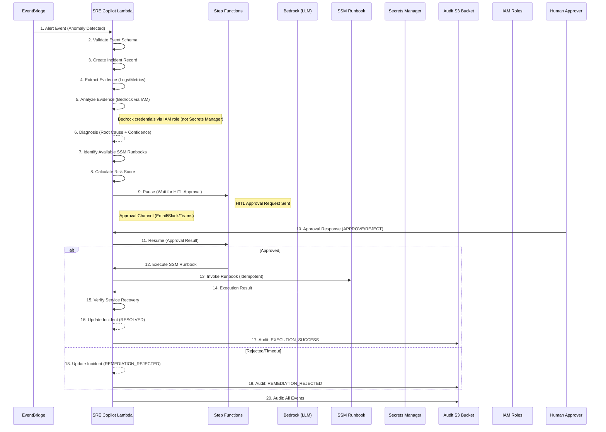
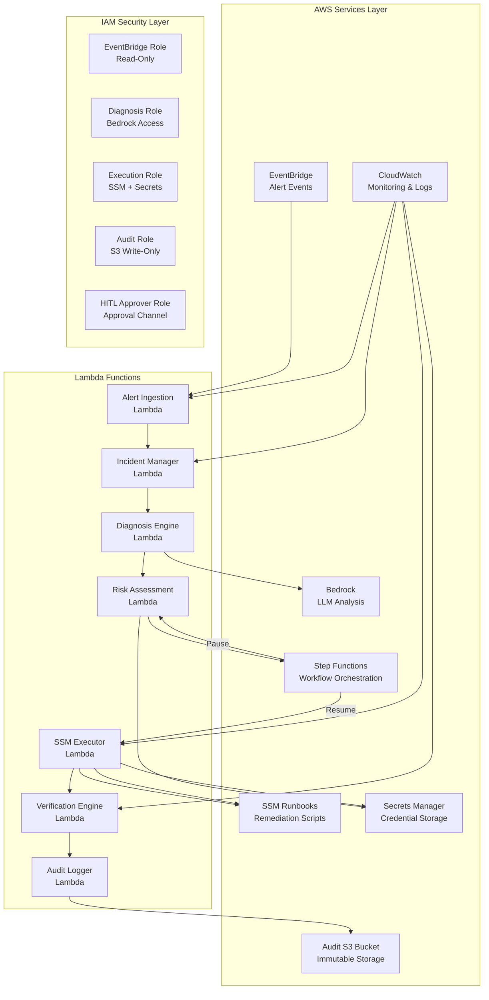
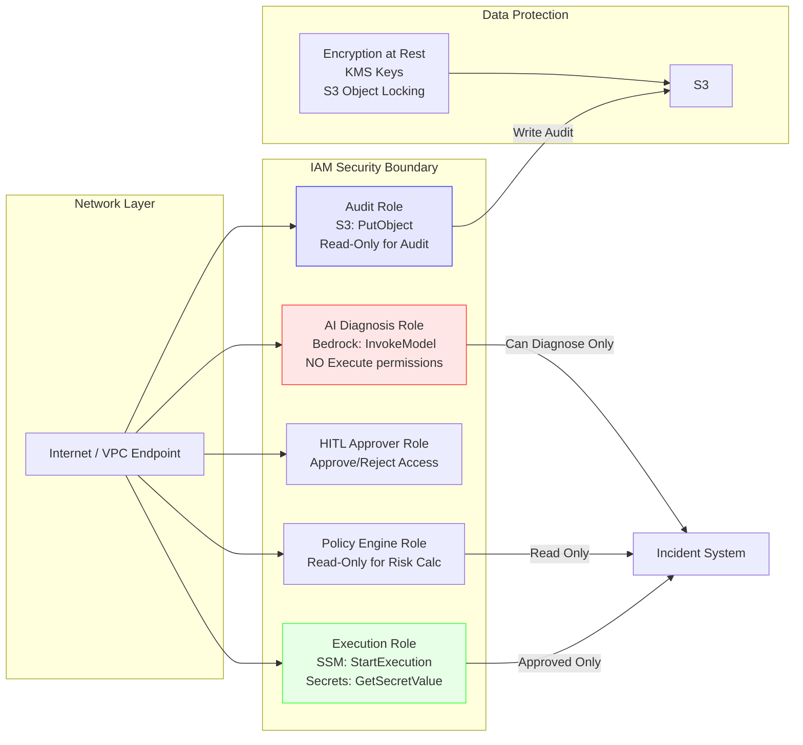
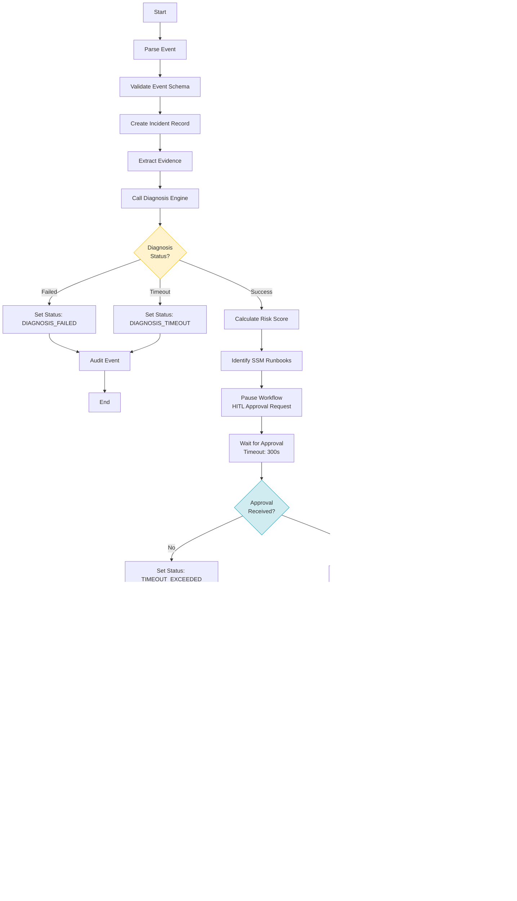

# Design Document: SRE Copilot with Human-in-the-Loop (HITL)

## Overview

The SRE Copilot is an AIOps system that receives infrastructure telemetry, analyzes anomalies using AI, proposes remediations with risk assessments, requires human approval for all state-changing operations, and executes approved remediations via AWS Systems Manager. The system maintains a complete audit trail of all decisions, recommendations, and actions taken during incident response workflows.

### Architectural Safety Invariant

The SRE Copilot adheres to the following architectural safety invariant:

- **AI recommends**: The AI Diagnosis Engine analyzes evidence and proposes root causes and remediation actions
- **Policy evaluates**: The Policy/Risk Engine evaluates operational impact and calculates risk scores
- **Human authorizes**: The HITL Approval component provides explicit human authorization for state-changing operations
- **Automation executes**: The Execution Engine executes only pre-authorized actions
- **System verifies**: The Verification Engine checks if remediation achieved desired outcomes
- **Audit records**: The Audit System records all decisions, approvals, executions, and results

**Security Boundary**: No component may bypass the HITL approval boundary to execute state-changing remediations. AI/LLM components can ONLY diagnose, analyze, and recommend - NEVER execute changes directly.

**Architectural Safety Explicit Statement**: The AI Diagnosis Engine has NO permissions to invoke SSM, modify infrastructure, or perform any state-changing operations. It can ONLY diagnose, analyze evidence, and recommend remediations.

### MVP Scope

This design focuses on an MVP implementation with:
- Single complete remediation scenario end-to-end
- One incident type (critical service failure on EC2/SSM-managed node detected via CloudWatch Alarms)
- One remediation type (critical service restart via SSM Runbook)
- One environment (development/staging)
- Basic audit trail configuration (30-day retention)

MVP Workflow: Service healthy → Service failure → Anomaly detected → Incident created → Evidence collected → Bedrock diagnosis → Risk assessment → HITL approval → SSM service remediation → Health verification → RESOLVED

## Architecture

### System Architecture Diagram



### Component Interaction Diagram



### Security Architecture Diagram



## Components and Interfaces

### AI Diagnosis Engine

**Purpose**: Analyze evidence and propose root causes and remediation actions

**Inputs**:
- `incident_id`: UUID v4 format
- `node_id`: String identifying the affected node
- `service_name`: String identifying the service
- `error_log`: String (max 10,000 characters) containing error logs
- `node_context`: JSON object with node metadata (type, region, tags)

**Outputs**:
```json
{
  "diagnosis_id": "uuid",
  "incident_id": "uuid",
  "diagnosis_summary": "string (max 2000 chars)",
  "probable_root_cause": {
    "cause_type": "service_crash|resource_exhaustion|configuration_error|network_issue|dependency_failure|unknown",
    "description": "string",
    "evidence_correlation": "string"
  },
  "ai_confidence_score": 0.0-1.0,
  "supporting_evidence": [
    {
      "log_excerpt": "string (max 500 chars)",
      "timestamp": "ISO 8601",
      "severity": "ERROR|WARN|INFO"
    }
  ],
  "recommended_remediations": [
    {
      "ssm_runbook_name": "string",
      "action_description": "string",
      "estimated_recovery_time_minutes": integer
    }
  ],
  "generated_at": "ISO 8601"
}
```

**Permissions** (IAM Role):
- `bedrock:InvokeModel` - Invoke LLM for analysis
- `logs:CreateLogGroup`, `logs:CreateLogStream`, `logs:PutLogEvents` - Logging
- **Note**: No Secrets Manager access - Bedrock credentials provided via IAM execution role

**Limitations**:
- NO permissions to invoke SSM Runbooks directly
- NO permissions to modify infrastructure
- NO permissions to send approval requests
- Analysis timeout: 30 seconds
- Maximum log length: 10,000 characters

**Error Handling**:
- Timeout: Return error response with `diagnosis_timeout` status
- Bedrock error: Return error response with `diagnosis_failed` status
- Invalid input: Return validation error

---

### Policy/Risk Engine

**Purpose**: Evaluate operational impact and calculate risk scores for proposed remediations

**Inputs**:
- `incident_id`: UUID
- `probable_root_cause`: JSON object from diagnosis
- `recommended_remediations`: Array from diagnosis
- `node_context`: JSON object with node metadata
- `environment_info`: JSON object with environment details
- `service_criticality`: Integer (1-100)
- `audit_trail_id`: UUID

**Risk Score Calculation**:
```
remediation_risk = (
  action_impact * 0.25 +
  blast_radius_factor * 0.25 +
  environment_criticality * 0.25 +
  service_criticality * 0.25
)
```

Where:
- `action_impact`: 0-100 (severity of remediation action)
- `blast_radius_factor`: 0-100 (affected services * affected nodes * dependency_impact)
- `environment_criticality`: 0-100 (prod=100, staging=50, dev=25)
- `service_criticality`: 0-100 (from service registry)

**Outputs**:
```json
{
  "risk_assessment_id": "uuid",
  "incident_id": "uuid",
  "remediation_risk": 0-100,
  "risk_factors": {
    "action_impact": 0-100,
    "blast_radius_factor": 0-100,
    "environment_criticality": 0-100,
    "service_criticality": 0-100,
    "calculated_risk_score": 0-100
  },
  "blast_radius_assessment": {
    "affected_services": ["service1", "service2"],
    "affected_nodes": ["node1", "node2"],
    "dependency_impact": "none|low|medium|high|critical",
    "estimated_outage_duration_minutes": 5,
    "rollback_complexity": "simple|moderate|complex"
  },
  "suggested_approval_timeout_seconds": 300,
  "generated_at": "ISO 8601"
}
```

**Permissions** (IAM Role):
- `secretsmanager:GetSecretValue` - Retrieve environment info
- `dynamodb:GetItem` - Read service criticality registry
- `logs:CreateLogGroup`, `logs:CreateLogStream`, `logs:PutLogEvents` - Logging

**Timeout**: 10 seconds maximum

---

### HITL Approval Service

**Purpose**: Provide explicit human authorization for state-changing operations

**Approval Request Format**:
```json
{
  "approval_request_id": "uuid",
  "incident_id": "uuid",
  "request_timestamp": "ISO 8601",
  "request_hash": "sha256(incident_id + timestamp)",
  "approval_channel": "email|slack|teams",
  "approval_details": {
    "incident_id": "uuid",
    "diagnosis_summary": "string",
    "probable_root_cause": "string",
    "proposed_ssm_runbook": "string",
    "blast_radius_assessment": { ... },
    "ai_confidence_score": 0.0-1.0,
    "remediation_risk": 0-100,
    "suggested_approval_timeout_seconds": 300
  }
}
```

**Approval Response Format**:
```json
{
  "approval_request_id": "uuid",
  "incident_id": "uuid",
  "response_timestamp": "ISO 8601",
  "response_hash": "sha256(request_hash + response_timestamp)",
  "decision": "approve|reject",
  "approver_identity": {
    "user_id": "string",
    "user_name": "string",
    "user_email": "string"
  },
  "rationale": "string (optional)",
  "verified_request_hash": "sha256(original_request_hash)"
}
```

**Timeout Handling**:
- Default: 300 seconds (configurable 60-3600)
- Auto-reject after timeout
- Log rejection with timestamp and reason

**Permissions** (IAM Role):
- `secretsmanager:GetSecretValue` - Retrieve approval channel credentials
- `logs:CreateLogGroup`, `logs:CreateLogStream`, `logs:PutLogEvents` - Logging
- `sqs:SendMessage` - Send approval response to queue (if async)

**Security**:
- Approval requests are signed with SHA256 hash
- Responses must verify the request hash
- Approval channels must authenticate approvers
- All approval actions are logged to audit trail

---

### SSM Execution Engine

**Purpose**: Execute approved SSM Runbooks via AWS Systems Manager

**Execution Flow**:
1. Retrieve SSM Runbook parameters from incident record
2. Generate idempotency token (UUID v4)
3. Invoke SSM Runbook with idempotency token
4. Poll execution status (5-second intervals)
5. Handle timeout (default: 300 seconds)
6. On success, trigger health verification
7. On failure, retry up to 3 times with exponential backoff

**Idempotency Handling**:
- Use `IdempotencyToken` parameter in SSM `start_execution`
- Runbook validates preconditions before executing
- If remediation already applied, runbook exits gracefully with success

**SSM Execution Result Schema**:
```json
{
  "execution_id": "string",
  "status": "Pending|InProgress|Success|Failure|Cancelled|TimedOut",
  "start_time": "ISO 8601",
  "end_time": "ISO 8601 | null",
  "output_document_url": "string | null",
  "error_message": "string | null",
  "retry_count": 0-3,
  "execution_parameters": {
    "instance_id": "string",
    "runbook_name": "string",
    "idempotency_token": "uuid"
  },
  "recovery_verified": "boolean | null"
}
```

**Retry Logic**:
- Maximum retries: 3
- Initial backoff: 5 seconds
- Maximum backoff: 60 seconds
- Backoff formula: `min(5 * 2^retry, 60)`
- Only retry on transient failures (timeout, service unavailable)

**Permissions** (IAM Role):
- `ssm:StartExecution` - Start SSM runbook execution
- `ssm:DescribeExecution` - Poll execution status
- `ssm:StopExecution` - Cancel execution on timeout
- `secretsmanager:GetSecretValue` - Retrieve credentials
- `logs:CreateLogGroup`, `logs:CreateLogStream`, `logs:PutLogEvents` - Logging

---

### Verification Engine

**Purpose**: Verify service recovery after remediation execution

**Verification Flow**:
1. Retrieve original anomaly detection configuration
2. Execute same monitoring check with identical parameters
3. Compare result to expected recovery threshold
4. Log verification result to audit trail
5. Update incident status based on verification outcome

**Verification Result Schema**:
```json
{
  "verification_id": "uuid",
  "incident_id": "uuid",
  "verification_method": "cloudwatch_alarm|http_check|tcp_check|custom_script",
  "verification_parameters": {
    "metric_name": "string",
    "namespace": "string",
    "threshold": "number",
    "comparison_operator": "GreaterThanThreshold|LessThanThreshold|..."
  },
  "verification_timestamp": "ISO 8601",
  "outcome": "SUCCESS|FAILURE|ERROR",
  "actual_value": "number | null",
  "error_message": "string | null",
  "service_recovered": "boolean"
}
```

**Timeout**: 30 seconds maximum

**Error Handling**:
- No monitoring configuration: Set status to `VERIFICATION_ERROR`
- Verification timeout: Treat as verification failure
- Transient errors: Retry once with backoff

**Permissions** (IAM Role):
- `cloudwatch:GetMetricStatistics` - Query metrics
- `logs:StartQuery`, `logs:GetQueryResults` - Query logs
- `lambda:InvokeFunction` - Run custom verification scripts
- `secretsmanager:GetSecretValue` - Retrieve verification credentials
- `logs:CreateLogGroup`, `logs:CreateLogStream`, `logs:PutLogEvents` - Logging

---

### Audit System

**Purpose**: Record all decisions, approvals, executions, and results

**Storage**: Amazon S3 with versioning and optional object locking

**Bucket Configuration**:
- Versioning: Enabled
- Object Locking: Configurable (disabled for MVP, enabled for production based on compliance requirements)
- Default retention: 30 days (configurable 1-3650 days)
- Encryption: AES-256 or KMS
- Access: IAM role-based (read-only for audit reviewers)

**Audit Trail Entry Schema**:
```json
{
  "audit_id": "uuid",
  "incident_id": "uuid",
  "timestamp": "ISO 8601",
  "actor": "system|human",
  "actor_identity": {
    "user_id": "string | null",
    "user_name": "string | null",
    "user_email": "string | null",
    "role": "string"
  },
  "action": "INCIDENT_CREATED|DIAGNOSIS_GENERATED|RISK_ASSESSED|APPROVAL_REQUESTED|APPROVAL_RECEIVED|EXECUTION_STARTED|EXECUTION_COMPLETED|VERIFICATION_COMPLETED|STATUS_UPDATED",
  "details": {
    "previous_status": "string | null",
    "new_status": "string",
    "diagnosis": { ... } | null,
    "risk_assessment": { ... } | null,
    "approval_response": { ... } | null,
    "execution_result": { ... } | null,
    "verification_result": { ... } | null
  },
  "correlation_id": "uuid",
  "source_ip": "string | null"
}
```

**Audit Events**:
1. `INCIDENT_CREATED`: Alert ingestion successful
2. `DIAGNOSIS_GENERATED`: AI diagnosis completed
3. `RISK_ASSESSED`: Risk assessment completed
4. `APPROVAL_REQUESTED`: HITL approval request sent
5. `APPROVAL_RECEIVED`: Human approval response received
6. `EXECUTION_STARTED`: SSM execution initiated
7. `EXECUTION_COMPLETED`: SSM execution finished
8. `VERIFICATION_COMPLETED`: Health verification finished
9. `STATUS_UPDATED`: Incident status changed

**Permissions** (IAM Role):
- `s3:PutObject` - Write audit entries (no Delete/Update)
- `s3:GetObjectVersion` - Read audit entries (specific version)
- `kms:Decrypt` - Decrypt audit data (if KMS encrypted)
- `logs:CreateLogGroup`, `logs:CreateLogStream`, `logs:PutLogEvents` - Logging

---

## Data Models

### Alert Event Schema (EventBridge)

```json
{
  "version": "string",
  "id": "uuid",
  "source": "aws.events",
  "account": "string",
  "time": "ISO 8601",
  "region": "string",
  "resources": ["string"],
  "detail": {
    "alert_id": "uuid",
    "node_id": "string",
    "service_name": "string",
    "error_log": "string (max 10000 chars)",
    "severity": "critical|high|medium|low",
    "timestamp": "ISO 8601",
    "monitoring_source": "cloudwatch|datadog|prometheus|custom",
    "monitoring_config": {
      "metric_name": "string",
      "namespace": "string",
      "threshold": "number",
      "comparison_operator": "string"
    }
  }
}
```

### Incident Record Schema

```json
{
  "incident_id": "uuid",
  "status": "CREATED|DIAGNOSIS_FAILED|DIAGNOSIS_TIMEOUT|REMEDIATION_REJECTED|RESOLVED|RECOVERY_FAILED|VERIFICATION_ERROR|RESOLVED_MANUALLY|TIMEOUT_EXCEEDED",
  "node_id": "string",
  "service_name": "string",
  "error_log": "string",
  "severity": "critical|high|medium|low",
  "timestamp": "ISO 8601",
  "diagnosis": {
    "diagnosis_id": "uuid",
    "diagnosis_summary": "string",
    "probable_root_cause": {
      "cause_type": "string",
      "description": "string",
      "evidence_correlation": "string"
    },
    "ai_confidence_score": 0.0-1.0,
    "supporting_evidence": [{ ... }],
    "recommended_remediations": [{ ... }]
  },
  "risk_assessment": {
    "risk_assessment_id": "uuid",
    "remediation_risk": 0-100,
    "risk_factors": { ... },
    "blast_radius_assessment": { ... }
  },
  "hitl_approval": {
    "approval_request_id": "uuid",
    "request_timestamp": "ISO 8601",
    "response_timestamp": "ISO 8601 | null",
    "decision": "approve|reject|null",
    "approver_identity": { ... },
    "rationale": "string | null"
  },
  "ssm_execution": {
    "execution_id": "string",
    "status": "string",
    "start_time": "ISO 8601 | null",
    "end_time": "ISO 8601 | null",
    "output_document_url": "string | null",
    "error_message": "string | null",
    "retry_count": 0-3,
    "recovery_verified": "boolean | null"
  },
  "health_verification": {
    "verification_id": "uuid",
    "verification_method": "string",
    "outcome": "SUCCESS|FAILURE|ERROR",
    "service_recovered": "boolean | null",
    "error_message": "string | null"
  },
  "audit_trail": ["audit_entry_id"],
  "created_at": "ISO 8601",
  "updated_at": "ISO 8601"
}
```

### Incident Status Values

| Status | Description |
|--------|-------------|
| `CREATED` | Incident ingested, awaiting diagnosis |
| `DIAGNOSIS_FAILED` | AI diagnosis failed (Bedrock error) |
| `DIAGNOSIS_TIMEOUT` | AI diagnosis timed out (30 seconds) |
| `REMEDIATION_REJECTED` | Human rejected remediation proposal |
| `RESOLVED` | Remediation succeeded AND verification passed |
| `RECOVERY_FAILED` | Remediation succeeded BUT verification failed |
| `VERIFICATION_ERROR` | Verification could not run (no monitoring config) |
| `RESOLVED_MANUALLY` | Incident resolved manually without HITL |
| `TIMEOUT_EXCEEDED` | HITL approval timeout (300 seconds default) |

### Diagnosis Schema

```json
{
  "diagnosis_id": "uuid",
  "incident_id": "uuid",
  "diagnosis_summary": "string (max 2000 chars)",
  "probable_root_cause": {
    "cause_type": "service_crash|resource_exhaustion|configuration_error|network_issue|dependency_failure|unknown",
    "description": "string",
    "evidence_correlation": "string"
  },
  "ai_confidence_score": 0.0-1.0,
  "supporting_evidence": [
    {
      "log_excerpt": "string (max 500 chars)",
      "timestamp": "ISO 8601",
      "severity": "ERROR|WARN|INFO"
    }
  ],
  "recommended_remediations": [
    {
      "ssm_runbook_name": "string",
      "action_description": "string",
      "estimated_recovery_time_minutes": integer
    }
  ],
  "generated_at": "ISO 8601"
}
```

### Risk Assessment Schema

```json
{
  "risk_assessment_id": "uuid",
  "incident_id": "uuid",
  "remediation_risk": 0-100,
  "risk_factors": {
    "action_impact": 0-100,
    "blast_radius_factor": 0-100,
    "environment_criticality": 0-100,
    "service_criticality": 0-100,
    "calculated_risk_score": 0-100
  },
  "blast_radius_assessment": {
    "affected_services": ["string"],
    "affected_nodes": ["string"],
    "dependency_impact": "none|low|medium|high|critical",
    "estimated_outage_duration_minutes": integer,
    "rollback_complexity": "simple|moderate|complex"
  },
  "suggested_approval_timeout_seconds": 300,
  "generated_at": "ISO 8601"
}
```

### HITL Approval Request/Response Schema

**Request**:
```json
{
  "approval_request_id": "uuid",
  "incident_id": "uuid",
  "request_timestamp": "ISO 8601",
  "request_hash": "sha256(incident_id + request_timestamp)",
  "approval_channel": "email|slack|teams",
  "approval_details": {
    "incident_id": "uuid",
    "diagnosis_summary": "string",
    "probable_root_cause": "string",
    "proposed_ssm_runbook": "string",
    "blast_radius_assessment": { ... },
    "ai_confidence_score": 0.0-1.0,
    "remediation_risk": 0-100,
    "suggested_approval_timeout_seconds": 300
  }
}
```

**Response**:
```json
{
  "approval_request_id": "uuid",
  "incident_id": "uuid",
  "response_timestamp": "ISO 8601",
  "response_hash": "sha256(request_hash + response_timestamp)",
  "decision": "approve|reject",
  "approver_identity": {
    "user_id": "string",
    "user_name": "string",
    "user_email": "string"
  },
  "rationale": "string (optional)",
  "verified_request_hash": "sha256(original_request_hash)"
}
```

### SSM Execution Result Schema

```json
{
  "execution_id": "string",
  "status": "Pending|InProgress|Success|Failure|Cancelled|TimedOut",
  "start_time": "ISO 8601",
  "end_time": "ISO 8601 | null",
  "output_document_url": "string | null",
  "error_message": "string | null",
  "retry_count": 0-3,
  "execution_parameters": {
    "instance_id": "string",
    "runbook_name": "string",
    "idempotency_token": "uuid"
  },
  "recovery_verified": "boolean | null"
}
```

### Health Verification Result Schema

```json
{
  "verification_id": "uuid",
  "incident_id": "uuid",
  "verification_method": "cloudwatch_alarm|http_check|tcp_check|custom_script",
  "verification_parameters": {
    "metric_name": "string",
    "namespace": "string",
    "threshold": "number",
    "comparison_operator": "string"
  },
  "verification_timestamp": "ISO 8601",
  "outcome": "SUCCESS|FAILURE|ERROR",
  "actual_value": "number | null",
  "error_message": "string | null",
  "service_recovered": "boolean"
}
```

### Audit Trail Entry Schema

```json
{
  "audit_id": "uuid",
  "incident_id": "uuid",
  "timestamp": "ISO 8601",
  "actor": "system|human",
  "actor_identity": {
    "user_id": "string | null",
    "user_name": "string | null",
    "user_email": "string | null",
    "role": "string"
  },
  "action": "INCIDENT_CREATED|DIAGNOSIS_GENERATED|RISK_ASSESSED|APPROVAL_REQUESTED|APPROVAL_RECEIVED|EXECUTION_STARTED|EXECUTION_COMPLETED|VERIFICATION_COMPLETED|STATUS_UPDATED",
  "details": {
    "previous_status": "string | null",
    "new_status": "string",
    "diagnosis": { ... } | null,
    "risk_assessment": { ... } | null,
    "approval_response": { ... } | null,
    "execution_result": { ... } | null,
    "verification_result": { ... } | null
  },
  "correlation_id": "uuid",
  "source_ip": "string | null"
}
```

---

## State Machine Design

### Step Functions State Machine



### State Machine States

| State | Description | Timeout | Error Handling |
|-------|-------------|---------|----------------|
| `ParseEvent` | Parse incoming EventBridge event | 10s | Return validation error |
| `ValidateEvent` | Validate event schema | 10s | Return validation error |
| `CreateIncident` | Create incident record in DynamoDB | 5s | Retry 3x with backoff |
| `ExtractEvidence` | Extract logs/metrics for diagnosis | 5s | Retry 3x with backoff |
| `CallDiagnosisEngine` | Invoke AI diagnosis Lambda | 30s | Set status: DIAGNOSIS_FAILED |
| `CalculateRisk` | Calculate risk score | 10s | Set status: DIAGNOSIS_FAILED |
| `IdentifyRunbooks` | Identify applicable SSM runbooks | 5s | Set status: DIAGNOSIS_FAILED |
| `PauseHITL` | Pause workflow for HITL approval | - | Workflow enters PAUSED state |
| `WaitForApproval` | Wait for approval response | 300s | Set status: TIMEOUT_EXCEEDED |
| `ExecuteSSM` | Execute SSM runbook | 300s | Retry 3x with exponential backoff |
| `VerifyRecovery` | Verify service recovery | 30s | Set status: RECOVERY_FAILED or VERIFICATION_ERROR |
| `ResolveIncident` | Set status to RESOLVED | 5s | Audit event, end workflow |
| `ApprovalTimeout` | Set status to TIMEOUT_EXCEEDED | 5s | Audit event, end workflow |

### Pause/Resume Pattern

**Pause State**:
- Workflow enters PAUSED state
- HITL approval request is generated
- Approval request is sent to configured channel (Email/Slack/Teams)
- Workflow waits for approval response
- Timeout: 300 seconds (configurable)

**Resume Condition**:
- Approval response received via SQS queue or HTTP webhook
- Response contains: approval_request_id, decision, approver_identity, response_hash
- Workflow validates response hash and resumes execution
- If approved: proceed to SSM execution
- If rejected: set status to REMEDIATION_REJECTED

**State Preservation**:
- All workflow state is persisted in DynamoDB
- Resume from last completed state
- No state loss on timeout or interruption

### HITL Callback Pattern with Task Token

Step Functions supports a callback pattern using **Task Tokens** that enables long-running human approval workflows:

```
Step Functions → Generate/obtain Task Token → Send approval request → Wait for callback → Human Approver → Approval Callback Service → Validate approval → SendTaskSuccess or SendTaskFailure → Resume Step Functions
```

**Task Token Flow**:
1. Step Functions state receives a Task Token from the service integration
2. The Task Token is treated as sensitive information - it must be stored encrypted and never exposed in logs or user-facing interfaces
3. The approval request is sent to the approver with the Task Token securely embedded (e.g., in a signed JWT or database reference)
4. Human approver makes decision via approval channel (Email/Slack/Teams)
5. Approval callback service validates the decision and retrieves the original Task Token
6. Callback service calls `SendTaskSuccess` or `SendTaskFailure` with the Task Token
7. Step Functions workflow resumes execution based on the callback result

**Security Requirements**:
- Task Tokens must be stored in encrypted form (S3 with SSE-KMS or DynamoDB with KMS encryption)
- Task Tokens must never appear in CloudWatch Logs, EventBridge events, or user interfaces
- Approval callback service must validate the requester has permission to approve the specific incident
- Task Tokens must have a limited lifetime (match or exceed approval timeout)
- Approval request correlation must use additional identifiers (incident_id, request_timestamp) beyond just the Task Token

**Implementation Pattern**:
```json
{
  "Type": "Task",
  "Resource": "arn:aws:states:::sns:publish.waitForTaskToken",
  "Parameters": {
    "TopicArn": "${HITLApprovalTopicArn}",
    "Message": {
      "incident_id.$": "$.incident_id",
      "approval_request_id.$": "$.approval_request_id",
      "task_token.$": "$$.Task.Token",
      "approval_details": { ... }
    }
  }
}
```

The `SendTaskSuccess` or `SendTaskFailure` API call must include the exact Task Token received from Step Functions to resume the workflow.

---

## Error Handling

### Input Validation Errors

| Error Code | HTTP Status | Description | Retry |
|------------|-------------|-------------|-------|
| `INVALID_EVENT_SCHEMA` | 400 | EventBridge event does not match expected schema | No |
| `MISSING_REQUIRED_FIELD` | 400 | Required field is missing from event | No |
| `INVALID_SEVERITY` | 400 | Severity is not one of: critical, high, medium, low | No |
| `LOG_EXCEEDS_MAX_LENGTH` | 400 | Error log exceeds 10,000 characters | No |
| `INVALID_NODE_ID` | 400 | Node ID format is invalid | No |

### AI Diagnosis Errors

| Error Code | Status | Description | Retry |
|------------|--------|-------------|-------|
| `DIAGNOSIS_TIMEOUT` | DIAGNOSIS_TIMEOUT | Bedrock analysis exceeded 30-second timeout | No |
| `DIAGNOSIS_FAILED` | DIAGNOSIS_FAILED | Bedrock returned error response | No |
| `INVALID_DIAGNOSIS_RESPONSE` | DIAGNOSIS_FAILED | Bedrock response does not match expected schema | No |

### HITL Approval Errors

| Error Code | Status | Description | Retry |
|------------|--------|-------------|-------|
| `APPROVAL_TIMEOUT` | TIMEOUT_EXCEEDED | No approval received within configured timeout | No |
| `INVALID_APPROVAL_RESPONSE` | REMEDIATION_REJECTED | Approval response hash verification failed | No |
| `APPROVAL_REQUEST_FAILED` | DIAGNOSIS_FAILED | Failed to generate HITL approval request | No |

### SSM Execution Errors

| Error Code | Status | Description | Retry |
|------------|--------|-------------|-------|
| `EXECUTION_TIMEOUT` | TIMEOUT_EXCEEDED | SSM execution exceeded 300-second timeout | Yes (3x) |
| `EXECUTION_FAILED` | RECOVERY_FAILED | SSM execution returned failure | Yes (3x) |
| `EXECUTION_CANCELLED` | REMEDIATION_REJECTED | SSM execution was cancelled | No |
| `EXECUTION_START_FAILED` | DIAGNOSIS_FAILED | Failed to start SSM execution | Yes (3x) |

### Verification Errors

| Error Code | Status | Description | Retry |
|------------|--------|-------------|-------|
| `VERIFICATION_TIMEOUT` | VERIFICATION_ERROR | Verification exceeded 30-second timeout | Yes (1x) |
| `VERIFICATION_FAILED` | RECOVERY_FAILED | Verification check failed | No |
| `NO_VERIFICATION_METHOD` | VERIFICATION_ERROR | No monitoring configuration found for service | No |
| `VERIFICATION_START_FAILED` | VERIFICATION_ERROR | Failed to start verification check | Yes (1x) |

### Audit Errors

| Error Code | Status | Description | Retry |
|------------|--------|-------------|-------|
| `AUDIT_WRITE_FAILED` | DIAGNOSIS_FAILED | Failed to write audit trail entry | Yes (3x) |
| `AUDIT_STORAGE_UNAVAILABLE` | DIAGNOSIS_FAILED | S3 audit bucket is unavailable | Yes (3x) |

### Retry Logic

**SSM Execution**:
- Maximum retries: 3
- Initial backoff: 5 seconds
- Maximum backoff: 60 seconds
- Backoff formula: `min(5 * 2^retry, 60)`
- Only retry on transient failures (timeout, service unavailable)

**Verification**:
- Maximum retries: 1
- Initial backoff: 2 seconds
- Only retry on transient failures (timeout, service unavailable)

**Audit Write**:
- Maximum retries: 3
- Initial backoff: 1 second
- Maximum backoff: 10 seconds
- Backoff formula: `min(1 * 2^retry, 10)`

---

## Testing Strategy

### Test Approach

This SRE Copilot HITL feature is primarily Infrastructure as Code (IaC) focused. The design includes AWS CloudFormation/Terraform templates defining infrastructure components, data models for Lambda functions, and integration patterns between services.

**Property-Based Testing (PBT) is NOT appropriate** for this feature because:
1. The primary component is IaC (Terraform/CloudFormation templates)
2. Most functionality is infrastructure wiring, not pure functions
3. External service behavior (Bedrock, SSM, EventBridge) is tested via integration tests
4. The configuration validation is better suited to schema validation tests

**Instead, we use**:
1. **Snapshot tests** for IaC templates
2. **Schema validation tests** for data contracts
3. **Integration tests** for AWS service interactions
4. **Example-based unit tests** for Lambda function logic

---

### Unit Tests

**Target**: Lambda function business logic (not IaC)

**Test Coverage**:
- Event parsing and validation
- Evidence extraction logic
- Risk score calculation
- Error handling and edge cases
- Idempotency token generation

**Examples**:
```python
# Example unit test structure
def test_risk_score_calculation():
    """Test risk score calculation with known inputs"""
    risk = calculate_risk(
        action_impact=70,
        blast_radius_factor=50,
        environment_criticality=100,
        service_criticality=80
    )
    assert risk == 76.25  # Expected value

def test_validate_alert_event():
    """Test event schema validation"""
    valid_event = load_event("valid_alert.json")
    assert validate_event(valid_event) == (True, None)
    
    invalid_event = load_event("invalid_alert.json")
    is_valid, error = validate_event(invalid_event)
    assert is_valid == False
    assert error == "Missing required field: node_id"
```

**Configuration**:
- Minimum test coverage: 80% for Lambda functions
- Run with each code change
- CI/CD pipeline integration

---

### Integration Tests

**Target**: AWS service interactions

**Test Coverage**:
- EventBridge to Lambda integration
- Lambda to Bedrock integration (with mocks)
- Lambda to SSM integration (with mocks)
- SSM execution workflow
- Audit trail writing to S3

**Approach**:
- Use AWS SDK mocks for external services (Bedrock, SSM, S3)
- Test real integration for IaC deployment verification
- Test end-to-end workflow with integration tests

**Examples**:
```python
# Example integration test structure
def test_alert_ingestion_workflow():
    """Test complete alert ingestion workflow"""
    # Setup
    eventbridge = EventBridgeMock()
    lambda_client = LambdaMock()
    
    # Test: Publish alert event
    eventbridge.put_events([{
        "Source": "sre.copilot",
        "DetailType": "AnomalyDetected",
        "Detail": json.dumps(load_event("valid_alert.json"))
    }])
    
    # Verify: Incident created in DynamoDB
    incident = dynamodb.get_incident("incident-uuid")
    assert incident.status == "CREATED"
    
    # Verify: Diagnosis Lambda invoked
    assert lambda_client.invoked("diagnosis-engine")
```

**Configuration**:
- Run on every code change
- Run in CI/CD pipeline
- Use test AWS account with Isolated resources

---

### IaC Template Tests

**Target**: CloudFormation/Terraform templates

**Test Coverage**:
- Template syntax validation
- Resource configuration validation
- IAM role permissions (least privilege)
- S3 bucket policies (versioning, configurable Object Lock)
- SSM Runbook idempotency

**Approach**:
- Use `aws cloudformation validate-template` for CloudFormation
- Use `terraform validate` for Terraform
- Use `cloudformation-lint` or `tflint` for additional checks
- Use CDK assertions for infrastructure snapshots

**Examples**:
```python
# Example IaC test structure
def test_cloudformation_template():
    """Test CloudFormation template validation"""
    # Validate template syntax
    result = cloudformation.validate_template(
        TemplateBody=read_file("sre-copilot.yaml")
    )
    assert result["ValidateTemplate"] == True
    
    # Verify IAM roles have least privilege
    roles = extract_iam_roles(result)
    for role in roles:
        for policy in role["Policies"]:
            for statement in policy["PolicyDocument"]["Statement"]:
                # Check for wildcards - allow if justified with business justification
                if statement["Action"] == "*":
                    assert statement.get("BusinessJustification"), "Wildcard action requires business justification"
                    assert statement.get("Resource") != "*", "Wildcard action should have scoped resources"
                elif statement["Resource"] == "*":
                    assert statement.get("BusinessJustification"), "Wildcard resource requires business justification"
```

**Configuration**:
- Run in CI/CD pipeline before deployment
- Run `terraform validate` on every change
- Run `tflint` or `cfn-lint` as part of linting

---

### Schema Validation Tests

**Target**: Data contracts between components

**Test Coverage**:
- Alert event schema validation
- Incident record schema validation
- Diagnosis schema validation
- Risk assessment schema validation
- HITL approval request/response schema validation
- SSM execution result schema validation
- Health verification result schema validation
- Audit trail entry schema validation

**Approach**:
- Define JSON Schema for each data model
- Test that all valid inputs match schema
- Test that all invalid inputs fail schema validation
- Test schema evolution (backward compatibility)

**Examples**:
```python
# Example schema validation test structure
def test_alert_event_schema():
    """Test alert event schema validation"""
    schema = load_schema("alert-event.schema.json")
    
    # Test valid event
    valid_event = load_event("valid_alert.json")
    assert validate_json(valid_event, schema) == (True, None)
    
    # Test invalid event (missing required field)
    invalid_event = load_event("invalid_alert_missing_node_id.json")
    is_valid, error = validate_json(invalid_event, schema)
    assert is_valid == False
    assert "required" in error
    
    # Test invalid event (invalid severity)
    invalid_event = load_event("invalid_alert_bad_severity.json")
    is_valid, error = validate_json(invalid_event, schema)
    assert is_valid == False
    assert "enum" in error
```

**Configuration**:
- Run with each code change
- Run in CI/CD pipeline
- Validate all incoming/outgoing data

---

### Example-Based Tests

**Target**: Specific scenarios and edge cases

**Test Coverage**:
- Alert with max-length error log (10,000 chars)
- Alert with all whitespace error log (invalid)
- Diagnosis timeout (30 seconds)
- HITL approval timeout (300 seconds)
- SSM execution timeout (300 seconds)
- SSM execution failure (3 retries with backoff)
- Health verification with no monitoring config
- Audit write failure (S3 unavailable)

**Approach**:
- Create test fixtures for each scenario
- Test error handling and recovery
- Test timeout scenarios
- Test retry logic

**Examples**:
```python
# Example edge case test structure
def test_ssm_execution_with_retry():
    """Test SSM execution with retry logic"""
    # Setup: Mock SSM to fail twice, then succeed
    ssm_mock = SSMMock()
    ssm_mock.start_execution.side_effect = [
        SSMException("ServiceUnavailable"),
        SSMException("ServiceUnavailable"),
        {"ExecutionId": "exec-123"}
    ]
    
    # Execute: Retry up to 3 times
    result = execute_ssm_runbook(
        runbook_name="RestartCriticalService",
        instance_id="i-1234567890abcdef0",
        idempotency_token="uuid-123"
    )
    
    # Verify: Execution succeeded after retries
    assert result.status == "Success"
    assert ssm_mock.start_execution.call_count == 3
    
    # Verify: Backoff timing
    calls = ssm_mock.start_execution.call_args_list
    for i in range(len(calls) - 1):
        delay = calls[i+1].timestamp - calls[i].timestamp
        assert delay >= min(5 * 2^i, 60)
```

---

### Test Environment

**Test Accounts**:
- Development account: For unit/integration tests
- Staging account: For IaC deployment verification
- Production account: Read-only test access (no infrastructure changes)

**Test Data**:
- Sample alert events (valid and invalid)
- Sample incident records (all status types)
- Sample diagnoses (various root causes)
- Sample risk assessments (various risk levels)
- Sample approval requests/responses

**Test Infrastructure**:
- Isolated test VPC
- Test EventBridge bus
- Test Bedrock model access
- Test SSM Runbooks
- Test IAM roles

---

### Test Execution

**Local Development**:
```bash
# Run unit tests
pytest tests/unit/ -v --cov

# Run integration tests (requires AWS credentials)
pytest tests/integration/ -v

# Run IaC validation
terraform validate
tflint

# Run schema validation
pytest tests/schema/ -v
```

**CI/CD Pipeline**:
```yaml
# Example GitHub Actions workflow
name: SRE Copilot Tests

on: [push, pull_request]

jobs:
  unit-tests:
    runs-on: ubuntu-latest
    steps:
      - uses: actions/checkout@v3
      - name: Set up Python
        uses: actions/setup-python@v4
      - name: Run unit tests
        run: pytest tests/unit/ -v --cov
    
  integration-tests:
    runs-on: ubuntu-latest
    needs: unit-tests
    steps:
      - uses: actions/checkout@v3
      - name: Run integration tests
        run: pytest tests/integration/ -v
        env:
          AWS_ACCESS_KEY_ID: ${{ secrets.AWS_ACCESS_KEY_ID }}
          AWS_SECRET_ACCESS_KEY: ${{ secrets.AWS_SECRET_ACCESS_KEY }}
    
  iac-validate:
    runs-on: ubuntu-latest
    needs: unit-tests
    steps:
      - uses: actions/checkout@v3
      - name: Validate Terraform
        run: terraform validate
      - name: Run tflint
        run: tflint
```

---

### Coverage Metrics

**Code Coverage**:
- Lambda functions: 80% minimum
- IaC templates: 100% validation coverage

**Integration Coverage**:
- All AWS service interactions tested
- All error scenarios tested
- All timeout scenarios tested

**Test Metrics**:
- Unit tests: < 5 seconds per test
- Integration tests: < 30 seconds per test
- IaC validation: < 1 minute per run
- Full test suite: < 5 minutes