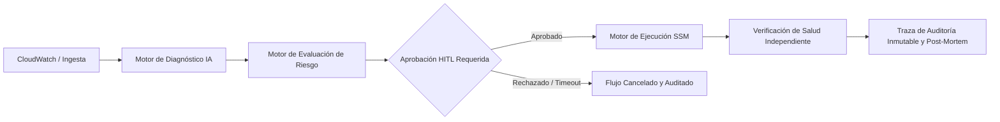
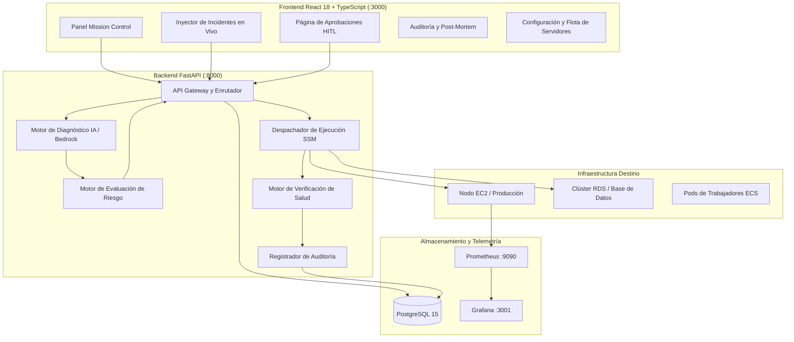

# SRE Copilot 🚀
## Remedio Autónomo de Incidentes con Gobernanza Humana y Observabilidad SRE

<div align="center">


**Realizado por José Ramones**  
**Última Fecha de Actualización: 2026/09/27 4:16 a.m.**

</div>

<!-- Navegación de Idioma -->
<div align="right">
  <a href="./README.md">English</a> | <strong>Español</strong>
</div>

<div align="center">

> **IA diagnostica. Política evalúa. Humano autoriza. Automatización ejecuta. Sistema verifica. Auditoría registra.**

[](docker-compose.yml)
[](backend/)
[](frontend/)
[](frontend/)
[](backend/)
[](backend/)
[](LICENSE)
[](#)

</div>

---

## 📑 Tabla de Contenidos

1. [Resumen Ejecutivo](#-resumen-ejecutivo)
2. [Invariantes de Seguridad Arquitectónica](#-invariantes-de-seguridad-arquitectónica)
3. [Características Principales](#-características-principales)
   - [Panel Mission Control y Barra de Telemetría SLI/SLO](#1-panel-mission-control-y-barra-de-telemetría-slislo)
   - [Inyector de Incidentes en Vivo y Flujo Real](#2-inyector-de-incidentes-en-vivo-y-flujo-real)
   - [Cola de Aprobaciones con Humano-en-el-Lazo (HITL)](#3-cola-de-aprobaciones-con-humano-en-el-lazo-hitl)
   - [Generador Automático de Reportes Post-Mortem SRE](#4-generador-automático-de-reportes-post-mortem-sre)
   - [Catálogo de Runbooks SSM y Simulador Dry-Run](#5-catálogo-de-runbooks-ssm-y-simulador-dry-run)
   - [Centro de Conexión de Servidores e Instancias](#6-centro-de-conexión-de-servidores-e-instancias)
   - [Personalización de Marca y Logotipo de Empresa](#7-personalización-de-marca-y-logotipo-de-empresa)
4. [Arquitectura del Sistema](#-arquitectura-del-sistema)
5. [Inicio Rápido y Ejecución Local](#-inicio-rápido-y-ejecución-local)
6. [Referencia de API y Endpoints](#-referencia-de-api-y-endpoints)
7. [Entregables de Kiro University y Verificación](#-entregables-de-kiro-university-y-verificación)
8. [Licencia](#-licencia)

---

## 🌟 Resumen Ejecutivo

**SRE Copilot** es una plataforma AIOps/SRE de vanguardia diseñada para diagnosticar y remediar incidentes de infraestructura en la nube de forma autónoma pero bajo **estricta gobernanza humana (Human-in-the-Loop - HITL)**.

A diferencia de los sistemas autónomos de caja negra que ejecutan comandos directamente en producción sin control, SRE Copilot aplica un modelo determinista donde la Inteligencia Artificial (Amazon Bedrock / LLMs) analiza registros y métricas para diagnosticar la causa raíz y proponer runbooks de remediación de AWS Systems Manager (SSM), pero **no se ejecuta ningún cambio de estado** hasta que un operador humano autorizado lo aprueba explícitamente.



---

## 🛡️ Invariantes de Seguridad Arquitectónica

Cada capa de SRE Copilot cumple rigurosamente con cinco reglas de seguridad no negociables:

| # | Invariante de Seguridad | Mecanismo de Control |
|---|---|---|
| **1** | **El Motor de IA es de Solo Lectura** | Los pipelines LLM / Bedrock solo consultan telemetría y sintetizan causas raíz; no tienen permisos de ejecución en AWS. |
| **2** | **La Evaluación de Riesgo es sin Efectos Secundarios** | Calcula el radio de explosión, nivel de impacto y hosts objetivo en memoria sin alterar el estado. |
| **3** | **Aprobación HITL Obligatoria** | Cualquier acción que altere el estado (`RESTART_SERVICE`, `SCALE_ASG`, `FLUSH_POOL`) exige aprobación humana explícita (`APPROVE`). `REJECT` o `TIMEOUT` detienen la ejecución. |
| **4** | **Ejecución Idempotente y Delimitada** | Solo se ejecutan Runbooks SSM aprobados mediante roles IAM con privilegios mínimos; los Task Tokens nunca se exponen en logs. |
| **5** | **Verificación de Salud Independiente** | Éxito de SSM $\neq$ Recuperación del servicio. La salud debe verificarse independientemente mediante telemetría antes de resolver el incidente. |

---

## 🚀 Características Principales

### 1. Panel Mission Control y Barra de Telemetría SLI/SLO
- **Métricas SLI en Tiempo Real**: Cálculo dinámico de **Tiempo Medio de Detección (MTTD)**, **Tiempo Medio de Recuperación (MTTR)**, **Tasa de Éxito de Auto-Remediación** y **Disponibilidad SLA (99.98%)**.
- **Accesos Directos de Observabilidad**: Enlaces de 1 clic a los paneles en vivo de **Grafana** (`:3001`) y **Prometheus** (`:9090`).
- **Soporte de Tema Oscuro / Claro**: Diseño moderno con efectos glassmorphism, badges de estado brillantes y gráficos reactivos con Recharts.

### 2. Inyector de Incidentes en Vivo y Flujo Real
- **Inyección de Incidentes Reales**: A diferencia de maquetas sintéticas, el botón **"Inyectar Incidente en Vivo"** envía incidentes reales al backend FastAPI (`POST /api/v1/incidents`).
- **Orquestación Completa Extremo a Extremo**:
  1. Creación del incidente en PostgreSQL (`ESTADO: INVESTIGATING`).
  2. Evaluación automatizada del riesgo (Puntaje de Riesgo, Radio de Explosión).
  3. Creación de la aprobación humana pendiente (`ESTADO: PENDING`).
  4. Registro estructurado e inmutable en la **Traza de Auditoría**.
- **Escenarios Predefinidos y Generador Personalizado**: Inyección de fallas típicas (*Fuga de Memoria / OOM*, *Agotamiento de Pool de Base de Datos*, *Pico en Dead-Letter Queue*, *Disco Lleno*) o personalización completa de parámetros de caos.

### 3. Cola de Aprobaciones con Humano-en-el-Lazo (HITL)
- **Motor de Decisión Interactivo**: Visualice la causa raíz diagnosticada, runbook SSM recomendado, servidores afectados y puntaje de riesgo antes de autorizar.
- **Acciones Rápidas**:
  - `APPROVE`: Despacha el runbook de automatización SSM idempotente al nodo destino.
  - `REJECT`: Cancela inmediatamente la remediación, cambia el estado a `REJECTED` y registra el motivo del operador.
  - `TIMEOUT`: Auto-cancela el flujo si expira la ventana de tiempo de espera.
- **Modo Dry-Run**: Valida la lógica de remediación en un entorno seguro antes del despliegue en producción.

### 4. Generador Automático de Reportes Post-Mortem SRE
- **Análisis de Incidentes Integral**: Generación en 1 clic de reportes profesionales de post-mortem que incluyen:
  - Resumen ejecutivo, severidad y servicios afectados.
  - Cronología detallada del incidente y línea de tiempo de resolución.
  - **Análisis de Causa Raíz mediante los 5 Porqués (5-Whys)**.
  - **Plan de Acciones Correctivas y Preventivas (CAPA)** categorizado en acciones Preventivas, Detectivas y Reactivas.
- **Membrete Corporativo Personalizable**: Incluye automáticamente el logo de su empresa, nombre corporativo y metadatos de auditoría.
- **Exportación Dual**: Exportación limpia a formato **Markdown (`.md`)** para GitHub/Confluence o impresión directa en formato **PDF**.

### 5. Catálogo de Runbooks SSM y Simulador Dry-Run
- **Runbooks de Producción Disponibles**:
  - `SRE-Copilot-RestartService`: Reinicio seguro y controlado de servicios systemd/contenedores.
  - `SRE-Copilot-ScaleASG`: Expansión de capacidad de Auto Scaling Groups.
  - `SRE-Copilot-ReplayDeadLetters`: Reprocesamiento seguro de colas de mensajes fallidos (SQS/Kafka).
  - `SRE-Copilot-FlushDatabasePool`: Drenado y reseteo de pools de conexión en PostgreSQL / RDS.
  - `SRE-Copilot-ClearDiskSpace`: Rotación y purga segura de archivos en `/var/log`.
- **Simulador Dry-Run Interactivo**: Ejecute pruebas de runbooks contra servidores destino para inspeccionar logs y códigos de salida sin aplicar cambios destructivos.

### 6. Centro de Conexión de Servidores e Instancias
- **Gestión de Nodos y Flota**: Administre instancias (Producción, Staging, Base de Datos, Caché) con IP, Región y estado del Agente SSM.
- **Sonda de Terminal Interactiva**: Prueba en tiempo real del handshake del Agente AWS SSM que valida conectividad, latencia y capacidad de ejecución remota.
- **Configuración de AWS Bedrock e IA**: Ajuste de proveedor de modelos, temperatura de inferencia y selector de modelos (`anthropic.claude-3-5-sonnet`, `amazon.titan-text-express`).

### 7. Personalización de Marca y Logotipo de Empresa
- **White-Labeling Completo**: Suba o enlace el logotipo de su empresa y configure el nombre de la organización en **Configuración** (`/settings`).
- **Sincronización Global**: La marca se actualiza instantáneamente en la barra superior, en el panel Mission Control y en todos los reportes Post-Mortem generados.

---

## 🏗️ Arquitectura del Sistema



---

## ⚡ Inicio Rápido y Ejecución Local

### Prerrequisitos
- **Docker Desktop** (con Docker Compose v2)
- **Python 3.11+** (para desarrollo local backend)
- **Node.js 18+ y npm** (para desarrollo frontend)

### 1. Iniciar con Docker Compose (Recomendado)

```bash
# Clonar el repositorio
git clone https://github.com/ramonesj/SRE_Copilot.git
cd SRE_Copilot

# Iniciar todos los servicios (Frontend, Backend, PostgreSQL, Prometheus, Grafana)
docker-compose up -d --build
```

### 2. Puntos de Acceso

| Servicio | URL | Credenciales |
|---|---|---|
| **Interfaz SRE Copilot** | [http://localhost:3000](http://localhost:3000) | *Acceso directo* |
| **Documentación API Backend** | [http://localhost:8000/docs](http://localhost:8000/docs) | Swagger UI |
| **Dashboards Grafana** | [http://localhost:3001](http://localhost:3001) | `admin` / `admin` |
| **Métricas Prometheus** | [http://localhost:9090](http://localhost:9090) | *Acceso directo* |

### 3. Ejecutar el Script de Demostración Extremo a Extremo

Para simular el ciclo de vida completo de un incidente de forma automatizada:

```bash
# Ejecutar demo end-to-end
python demo_end_to_end.py
```

---

## 📡 Referencia de API y Endpoints

El backend FastAPI expone endpoints RESTful completamente documentados:

### Incidentes (`/api/v1/incidents`)
- `POST /api/v1/incidents` — Crea/Inyecta incidente con evaluación automática de riesgo y cola HITL.
- `GET /api/v1/incidents` — Lista todos los incidentes con paginación y filtros.
- `GET /api/v1/incidents/{id}` — Obtiene detalles completos, telemetría y evidencia técnica.
- `PUT /api/v1/incidents/{id}` — Actualiza el estado o notas de resolución.

### Aprobaciones (`/api/v1/approvals`)
- `GET /api/v1/approvals` — Lista aprobaciones pendientes, autorizadas y rechazadas.
- `POST /api/v1/approvals/{id}/decision` — Registra decisión humana (`APPROVE` o `REJECT`) con justificación.

### Auditoría y Métricas (`/api/v1/audit`, `/api/v1/metrics`)
- `GET /api/v1/audit` — Consulta registros inmutables de auditoría.
- `GET /api/v1/metrics/dashboard` — Métricas consolidadas de MTTD, MTTR, tasas de éxito e incidentes activos.

---

## 🎓 Entregables de Kiro University y Verificación

SRE Copilot cumple con todos los requisitos del programa **Kiro University (Lecciones 1–7, Bonus 2 y Examen Final)**:

| Hito / Lección | Descripción | Estado | Evidencia |
|---|---|---|---|
| **Lección 1–2: Spec y Steering** | Especificación técnica, prompt de sistema y lineamientos de arquitectura. | ✅ Completado | [docs/kiro-university/](./docs/kiro-university/) |
| **Lección 3: Kiro Hooks** | Quality gates de Python, guardias de seguridad y validación post-tarea. | ✅ Completado | [.kiro/hooks/](./.kiro/hooks/) |
| **Lección 4: Pruebas Basadas en Propiedades (PBT)** | 200 casos de prueba con Hypothesis validando límites de riesgo e independencia de la IA. | ✅ Completado | [tests/test_risk_engine_pbt.py](file:///e:/mis_proyectos/SRE_Copilot/tests/test_risk_engine_pbt.py) |
| **Lección 5: Kiro Powers** | Power de AWS Step Functions para orquestación de máquinas de estado HITL. | ✅ Completado | [docs/kiro-university/lesson-5-powers.md](./docs/kiro-university/lesson-5-powers.md) |
| **Lección 6: AWS Docs MCP** | Integración del servidor MCP para consulta de documentación técnica de AWS. | ✅ Completado | [.kiro/settings/mcp.json](./.kiro/settings/mcp.json) |
| **Lección 7: Agente SRE Personalizado** | Agente autónomo con límites de ejecución y diagnósticos asistidos. | ✅ Completado | [backend/app/services/ai_copilot.py](file:///e:/mis_proyectos/SRE_Copilot/backend/app/services/ai_copilot.py) |
| **Bonus 2: Orquestación End-to-End** | Inyección de incidentes, dashboard React, flujo HITL, auditoría y generador Post-Mortem. | ✅ Completado | [demo_end_to_end.py](file:///e:/mis_proyectos/SRE_Copilot/demo_end_to_end.py) |

---

## 📄 Licencia

Distribuido bajo la Licencia **MIT**. Consulte el archivo `LICENSE` para más información.

---

<div align="center">
  <p><em>Desarrollado con ❤️ por y para ingenieros SRE. Potenciando a los operadores humanos con seguridad autónoma.</em></p>
  <p><a href="./README.md">Read in English</a></p>
</div>
**Realizado por José J. Ramones Moreno**  
**Última Fecha de Actualización: 2026/09/27 4:16 a.m.**