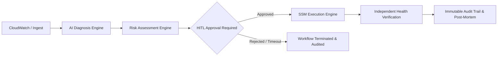
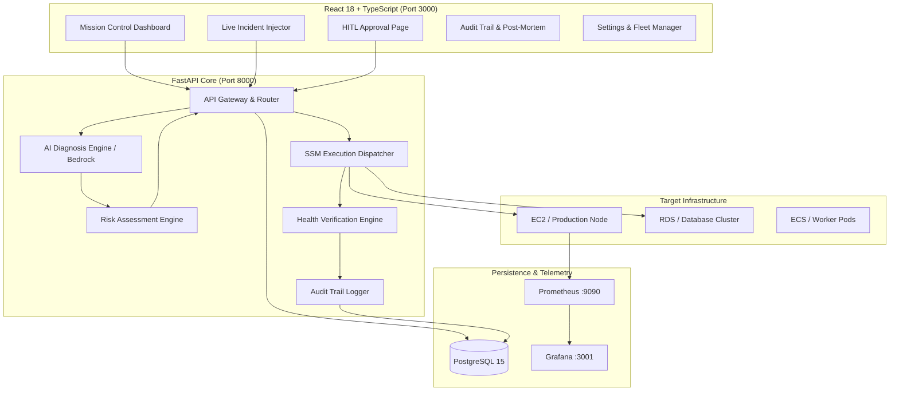

# SRE Copilot 🚀
## Autonomous Incident Remediation with Human Governance & SRE Observability

<!-- Language Selector -->
<div align="right">
  <strong>English</strong> | <a href="./README.es.md">Español</a>
</div>

<div align="center">

> **AI Recommends. Policy Evaluates. Human Authorizes. Automation Executes. System Verifies. Audit Records.**

[](docker-compose.yml)
[](backend/)
[](frontend/)
[](frontend/)
[](backend/)
[](backend/)
[](LICENSE)
[](#)

</div>

---

## 📑 Table of Contents

1. [Executive Overview](#-executive-overview)
2. [Architectural Safety Invariants](#-architectural-safety-invariants)
3. [Key Features & Capabilities](#-key-features--capabilities)
   - [Mission Control & SLI/SLO Telemetry Bar](#1-mission-control--slislo-telemetry-bar)
   - [Live Incident Injector & Real Pipeline](#2-live-incident-injector--real-pipeline)
   - [Human-In-The-Loop (HITL) Approval Queue](#3-human-in-the-loop-hitl-approval-queue)
   - [Automated SRE Post-Mortem Report Generator](#4-automated-sre-post-mortem-report-generator)
   - [SSM Runbook Catalog & Dry-Run Simulator](#5-ssm-runbook-catalog--dry-run-simulator)
   - [Target Fleet & Server Node Connection Hub](#6-target-fleet--server-node-connection-hub)
   - [Enterprise Company Branding & Logo Customization](#7-enterprise-company-branding--logo-customization)
4. [System Architecture](#-system-architecture)
5. [Quick Start & Running Locally](#-quick-start--running-locally)
6. [API Reference & Verification Endpoints](#-api-reference--verification-endpoints)
7. [Kiro University Deliverables & Verification](#-kiro-university-deliverables--verification)
8. [License](#-license)

---

## 🌟 Executive Overview

**SRE Copilot** is a state-of-the-art autonomous incident diagnosis and remediation platform designed for modern Site Reliability Engineering (SRE) and DevOps teams. 

Unlike black-box autonomous systems that execute unverified scripts directly against production nodes, SRE Copilot strictly enforces a **deterministic Human-in-the-Loop (HITL) governance model**. The AI analyzes logs and metrics to diagnose root causes and suggest AWS Systems Manager (SSM) runbooks, but **zero state changes occur** until an authorized human engineer approves the operation.



---

## 🛡️ Architectural Safety Invariants

Every layer of SRE Copilot adheres to five non-negotiable safety rules:

| # | Invariant Rule | Enforcement Mechanism |
|---|---|---|
| **1** | **AI Engine is Read-Only** | LLM / Bedrock prompt pipelines only query telemetry and synthesize root causes; they have zero AWS execution permissions. |
| **2** | **Risk Assessment is Non-Executing** | Evaluates blast radius, blast score, and target nodes strictly in memory without side effects. |
| **3** | **Explicit HITL Approval Required** | All state-changing actions (`RESTART_SERVICE`, `SCALE_ASG`, `FLUSH_POOL`) require explicit human authorization (`APPROVE`). `REJECT` or `TIMEOUT` strictly halts remediation. |
| **4** | **Execution is Idempotent & Scoped** | Only authorized SSM runbooks are executed via dedicated worker roles; Task Tokens are never logged. |
| **5** | **Independent Verification** | Remediation success $\neq$ recovery. Service health must be independently verified by telemetry before closing an incident. |

---

## 🚀 Key Features & Capabilities

### 1. Mission Control & SLI/SLO Telemetry Bar
- **Real-Time SLI Telemetry**: Live metrics for **Mean Time to Detect (MTTD)**, **Mean Time to Recover (MTTR)**, **Auto-Remediation Success Rate**, and **Global SLA Availability (99.98%)**.
- **Observability Deep Links**: 1-click access to live **Grafana** (`:3001`) and **Prometheus** (`:9090`) telemetry dashboards.
- **Dark / Light Theme Support**: Polished mission-control aesthetic with modern glassmorphism, glowing status pills, and reactive Recharts analytics.

### 2. Live Incident Injector & Real Pipeline
- **Real Incident Injection**: Unlike synthetic UI mocks, the **"Inject Live Incident"** engine pushes actual incidents to the FastAPI backend (`POST /api/v1/incidents`).
- **Complete End-to-End Orchestration**: Automatically triggers:
  1. Incident creation in PostgreSQL (`STATUS: INVESTIGATING`).
  2. Automated Risk Assessment calculation (Risk Score, Blast Radius).
  3. Pending **Human Approval** creation (`STATUS: PENDING`).
  4. Structured entry in the **Immutable Audit Trail**.
- **Presets & Custom Chaos Builder**: Inject preconfigured outages (*High Memory Leak*, *Database Pool Exhaustion*, *Dead-Letter Queue Spike*, *Disk Space Exhaustion*) or define custom chaos parameters.

### 3. Human-In-The-Loop (HITL) Approval Queue
- **Interactive Decision Engine**: Review root-cause findings, recommended SSM runbooks, target hosts, and estimated risk score before taking action.
- **One-Click Authorization**:
  - `APPROVE`: Dispatches idempotent SSM automation runbook to the target node.
  - `REJECT`: Immediately aborts remediation, transitions incident to `REJECTED`, and logs human rationale.
  - `TIMEOUT`: Auto-cancels if the approval window expires.
- **Dry-Run Mode**: Test remediation logic safely in staging/simulated environments before actual dispatch.

### 4. Automated SRE Post-Mortem Report Generator
- **Comprehensive Incident Analysis**: One-click generation of professional post-mortems featuring:
  - Incident executive summary, severity, and impacted services.
  - Detailed incident chronology and resolution timeline.
  - **5-Whys Root Cause Analysis**.
  - **Preventative Action Items (CAPA)** categorized by Preventive, Detective, and Responsive actions.
- **Enterprise Company Letterhead**: Dynamically brands post-mortems with your company logo, company name, and document metadata.
- **Dual Export**: Export as clean **Markdown (`.md`)** for GitHub/Confluence or print directly as a styled **PDF**.

### 5. SSM Runbook Catalog & Dry-Run Simulator
- **Curated Production Runbooks**:
  - `SRE-Copilot-RestartService`: Graceful systemd/container service recycling.
  - `SRE-Copilot-ScaleASG`: Auto Scaling Group capacity expansion.
  - `SRE-Copilot-ReplayDeadLetters`: Safe SQS/Kafka dead-letter queue reprocessing.
  - `SRE-Copilot-FlushDatabasePool`: PostgreSQL / RDS connection pool draining.
  - `SRE-Copilot-ClearDiskSpace`: Safe rotation and pruning of `/var/log` artifacts.
- **Interactive Dry-Run Simulator**: Execute sandboxed runbook trials against target nodes to inspect logs and exit codes prior to production rollout.

### 6. Target Fleet & Server Node Connection Hub
- **Instance Management**: View and manage target nodes (Production, Staging, Database, Cache) with IP, Region, and SSM Agent connection status.
- **Live Terminal Probe**: Interactive AWS SSM Agent handshake test validating agent ping, latency, and remote command execution readiness.
- **AWS Bedrock & Model Configuration**: Configure AI provider settings, inference temperature, and model IDs (`anthropic.claude-3-5-sonnet`, `amazon.titan-text-express`).

### 7. Enterprise Company Branding & Logo Customization
- **Full Brand White-Labeling**: Upload or link your company logo and customize the organization name in **Settings** (`/settings`).
- **Global Synchronization**: Company branding updates in real-time across the top navigation bar, SRE Mission Control dashboard, and all Post-Mortem reports.

---

## 🏗️ System Architecture



---

## ⚡ Quick Start & Running Locally

### Prerequisites
- **Docker Desktop** (with Docker Compose v2)
- **Python 3.11+** (for local development)
- **Node.js 18+ & npm** (for frontend development)

### 1. Launch with Docker Compose (Recommended)

```bash
# Clone the repository
git clone https://github.com/ramonesj/SRE_Copilot.git
cd SRE_Copilot

# Start the full stack (Frontend, Backend, PostgreSQL, Prometheus, Grafana)
docker-compose up -d --build
```

### 2. Access Points

| Service | URL | Default Credentials |
|---|---|---|
| **SRE Copilot UI** | [http://localhost:3000](http://localhost:3000) | *No login required* |
| **Backend API Docs** | [http://localhost:8000/docs](http://localhost:8000/docs) | Swagger UI |
| **Grafana Dashboards** | [http://localhost:3001](http://localhost:3001) | `admin` / `admin` |
| **Prometheus Metrics** | [http://localhost:9090](http://localhost:9090) | *Open access* |

### 3. Run the End-to-End Simulation Script

To simulate an end-to-end incident lifecycle (Ingestion $\rightarrow$ Diagnosis $\rightarrow$ Risk $\rightarrow$ HITL Approval $\rightarrow$ Remediation $\rightarrow$ Verification $\rightarrow$ Audit):

```bash
# Run the automated demo script
python demo_end_to_end.py
```

---

## 📡 API Reference & Verification Endpoints

The FastAPI backend exposes fully documented RESTful endpoints:

### Incidents (`/api/v1/incidents`)
- `POST /api/v1/incidents` — Create/inject incident with auto risk assessment & HITL queue.
- `GET /api/v1/incidents` — List all incidents with pagination and status filtering.
- `GET /api/v1/incidents/{id}` — Get complete incident details, telemetry, and evidence.
- `PUT /api/v1/incidents/{id}` — Update incident status or resolution notes.

### Approvals (`/api/v1/approvals`)
- `GET /api/v1/approvals` — List all pending, approved, and rejected approvals.
- `POST /api/v1/approvals/{id}/decision` — Submit human authorization (`APPROVE` or `REJECT`) with rationale.

### Audit & Telemetry (`/api/v1/audit`, `/api/v1/metrics`)
- `GET /api/v1/audit` — Query immutable audit trail logs.
- `GET /api/v1/metrics/dashboard` — Aggregated MTTD, MTTR, success rates, and active incident counts.

---

## 🎓 Kiro University Deliverables & Verification

SRE Copilot satisfies all requirements across **Lessons 1–7**, **Bonus 2**, and **Exam Deliverables**:

| Milestone / Lesson | Description | Status | Evidence |
|---|---|---|---|
| **Lesson 1–2: Spec & Steering** | SRE Copilot system prompt, requirements, and design docs. | ✅ Complete | [docs/kiro-university/](./docs/kiro-university/) |
| **Lesson 3: Quality Hooks** | Python quality gates, security boundary guards, post-task validation. | ✅ Complete | [.kiro/hooks/](./.kiro/hooks/) |
| **Lesson 4: Property-Based Testing** | 200 Hypothesis property test cases validating Risk Score bounds & AI independence. | ✅ Complete | [tests/test_risk_engine_pbt.py](file:///e:/mis_proyectos/SRE_Copilot/tests/test_risk_engine_pbt.py) |
| **Lesson 5: Kiro Powers** | AWS Step Functions Power for HITL state machine orchestration. | ✅ Complete | [docs/kiro-university/lesson-5-powers.md](./docs/kiro-university/lesson-5-powers.md) |
| **Lesson 6: AWS Docs MCP** | Model Context Protocol integration for official AWS documentation retrieval. | ✅ Complete | [.kiro/settings/mcp.json](./.kiro/settings/mcp.json) |
| **Lesson 7: Custom SRE Agent** | Autonomous SRE agent with strict safety boundary execution. | ✅ Complete | [backend/app/services/ai_copilot.py](file:///e:/mis_proyectos/SRE_Copilot/backend/app/services/ai_copilot.py) |
| **Bonus 2: End-to-End Orchestration** | Live incident injection, UI dashboard, HITL approval, audit trail & post-mortem generator. | ✅ Complete | [demo_end_to_end.py](file:///e:/mis_proyectos/SRE_Copilot/demo_end_to_end.py) |

---

## 📄 License

Distributed under the **MIT License**. See `LICENSE` for more information.

---

<div align="center">
  <p><em>Built with ❤️ by SREs, for SREs. Empowering human operators with autonomous safety.</em></p>
  <p><a href="./README.es.md">Leer en Español</a></p>
</div>
