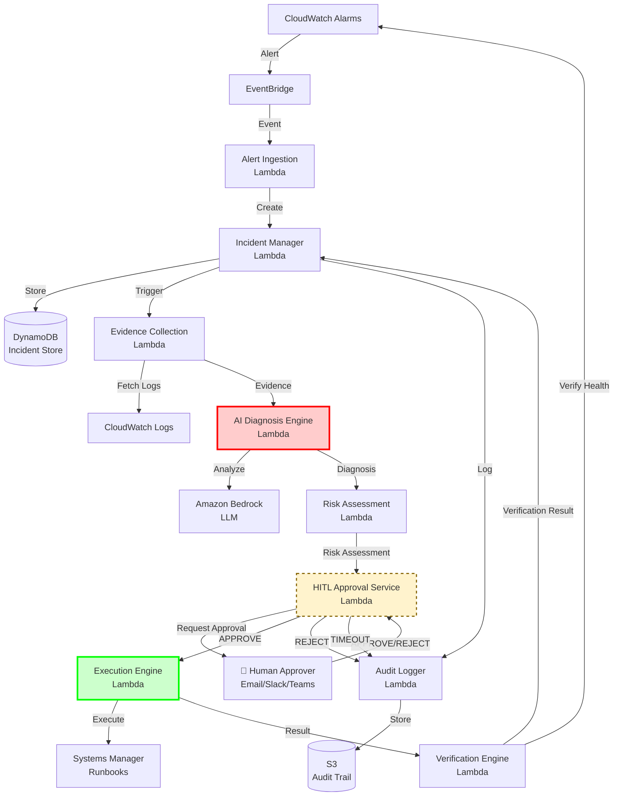
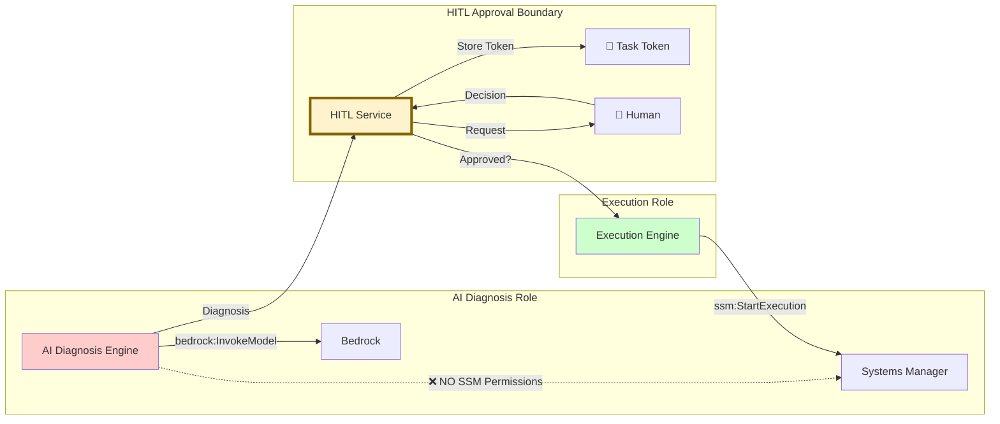
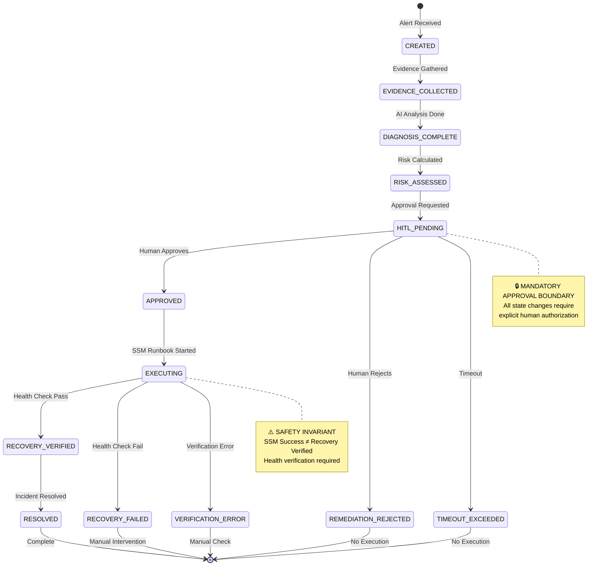
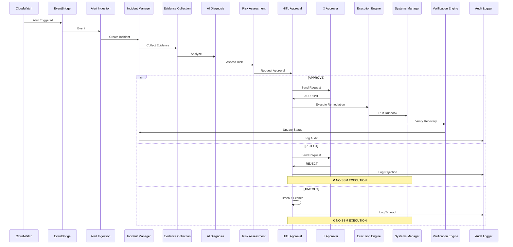
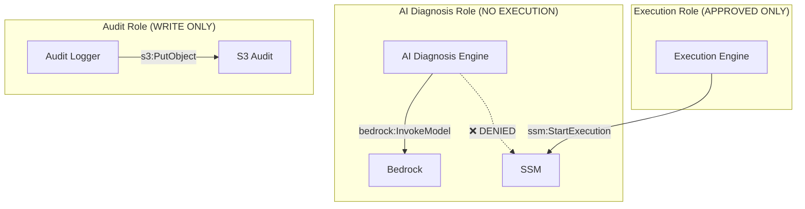
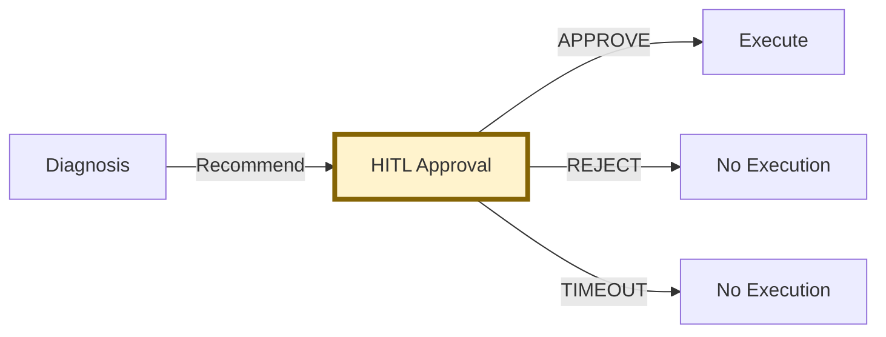
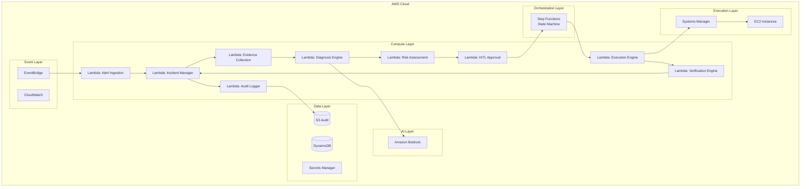

# SRE Copilot - Architecture Diagram

## Component Flow Diagram

---

## Security Architecture Diagram

---

## Incident Lifecycle State Machine

---

## Data Flow Diagram

---

## Component Responsibilities

| Component | Responsibility | IAM Permissions | Constraint |
|-----------|---------------|-----------------|------------|
| **Alert Ingestion** | Receive and validate events | `events:PutEvents` | Read-only validation |
| **Incident Manager** | Lifecycle management | `dynamodb:*` | No execution permissions |
| **Evidence Collection** | Gather logs and telemetry | `logs:GetLogEvents` | Read-only access |
| **AI Diagnosis Engine** | Analyze and diagnose | `bedrock:InvokeModel` | ❌ NO SSM permissions |
| **Risk Assessment** | Calculate risk scores | `ssm:ListDocuments` (read) | ❌ NO execution |
| **HITL Approval** | Request human approval | `secretsmanager:GetSecretValue` | No execution permissions |
| **Execution Engine** | Execute approved runbooks | `ssm:StartExecution` | Requires prior approval |
| **Verification Engine** | Verify service recovery | `cloudwatch:GetMetricData` | Read-only verification |
| **Audit Logger** | Record all events | `s3:PutObject` | Write-only audit |

---

## Security Boundaries

### 1. IAM Role Separation

### 2. Task Token Security

- Tokens are **NEVER** logged
- Encrypted in Secrets Manager
- Time-bound (expires after timeout)
- Single-use (invalidated after use)

### 3. Approval Boundary Enforcement

---

## Deployment Architecture

---

## Key Messages for Demo

### Safety Invariant Message

> **"SSM execution success alone does NOT mark incidents as RESOLVED.  
> Health verification is REQUIRED for RESOLVED status."**

### Security Boundary Message

> **"AI components can ONLY recommend, NEVER execute directly.  
> All state-changing operations require human approval."**

### Human Authority Message

> **"SRE Copilot assists but does NOT replace human judgment.  
> AI recommends, humans authorize."**

---

**Document Version**: 1.0  
**Last Updated**: September 26, 2026
